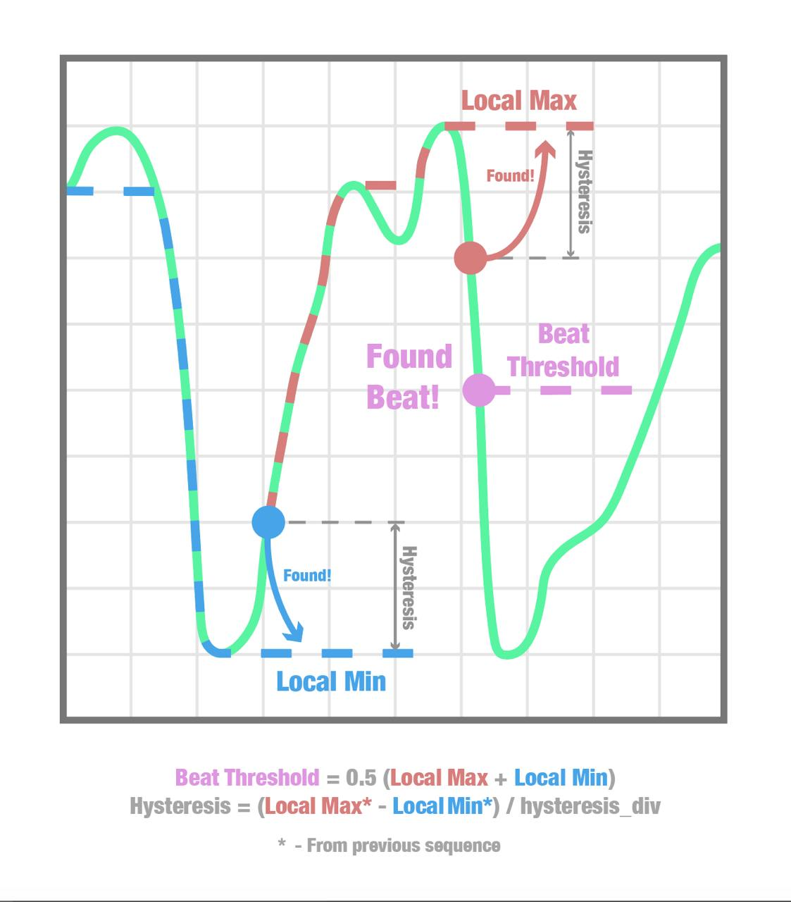

# ❤️ Simple Heart Rate Analyzer

A lightweight C library for detecting heart rate (BPM) from a photoplethysmographic (PPG) signal, based on local extrema detection, threshold crossing, and hysteresis.

- [📈 Algorithm Overview](#algorithm-overview)
- [⚙️ Signal Requirements](#signal-requirements)
- [🧩 API Quick Overview](#api-quick-overview)
- [🚀 How to Use](#how-to-use)
- [🔬 Tested Hardware](#tested-hardware)
- [⚠️ Known Limitations](#known-limitations)

## 📈 Algorithm Overview



### 🫀 Beat detection steps

1. Local Minimum Detection – the lowest point in a PPG valley.
2. Local Maximum Detection – the peak of the signal.
3. Beat Threshold Calculation:

    `beat_threshold = 0.5 * (local_max_val + local_min_val)`

    ➡️ This is the midpoint between the last detected local minimum and maximum. A beat is detected when the signal crosses the threshold from above. Falling edge is chosen because it tends to be steeper and more reliable for detecting the moment of a heartbeat.

4. Update Hysteresis and Reset Extrema:

    `hysteresis = (local_max_val - local_min_val) / hysteresis_div`

    🔒 This value sets the noise immunity — it ensures we don’t pick up small fluctuations as new extrema.

    The `hysteresis_div` parameter controls how sensitive the algorithm is: smaller values make it stricter, higher values more permissive.

## ⚙️ Signal Requirements

💡 This library does not perform any internal signal filtering. It assumes you're feeding it pre-filtered PPG samples.
To work reliably, the algorithm expects:

- A clean, smooth waveform without high-frequency noise
- No abrupt baseline jumps or motion artifacts
- A stable sampling rate
- We recommend applying a low-pass or band-pass filter before passing values to hr_analyzer_process_sample().

✅ Recommended Preprocessing
At minimum:

- Low-pass filtering (e.g., IIR or moving average)
- Baseline correction (if your sensor has drift)
- Optional: Median filtering on the output BPM to reduce jitter

This separation gives you full flexibility — use your own DSP library, CMSIS-DSP, or simple rolling filters tailored to your platform.

## 🧩 API Quick Overview

Main data structure:

```c
typedef struct pulsomteter {
    int32_t prev_sample_val;          ///< Previous sample value (used to detect slope changes)

    int32_t local_max_val;            ///< Detected local maximum value
    extrema_state_t local_max_state;  ///< State of local max tracking

    int32_t local_min_val;            ///< Detected local minimum value
    extrema_state_t local_min_state;  ///< State of local min tracking

    int32_t hysteresis;               ///< Current hysteresis value
    const int32_t hysteresis_div;     ///< Division factor for hysteresis calculation

    int32_t beat_threshold;           ///< Dynamic beat threshold (midpoint between extrema)
    int64_t prev_beat_ts;             ///< Timestamp of previous detected beat

    const float heart_rate_max_val;   ///< Max allowed heart rate (bpm)
    const float heart_rate_min_val;   ///< Min allowed heart rate (bpm)

    float heart_rate_val;             ///< Last calculated heart rate (bpm)
} hr_analyzer_st;
```

Functions:

```c
hr_analyzer_init(int32_t hysteresis_div);

float hr_analyzer_process_sample(hr_analyzer_st *analyzer, int32_t new_sample_val, 
        uint32_t current_time_ms);

void hr_analyzer_deinit(hr_analyzer_st *analyzer);
```

### 🚀 How to Use

1. Initialize the Analyzer

    ```c
    hr_analyzer_st *analyzer = hr_analyzer_init(hysteresis_div);
    ```

    ⚙️ `hysteresis_div`: an integer divisor used in hysteresis calculation. A typical value like 5 works well.
    Returns a pointer to an initialized analyzer, or NULL on allocation failure.

2. Feed in samples and check for beats

    ```c
    float bpm = hr_analyzer_process_sample(analyzer, new_sample_val, current_time_ms);
    ```

    📥 `new_sample_val`: an integer value from the PPG sensor. It should be filtered externally before calling this function.

    ⏱️ `current_time_ms`: current timestamp in milliseconds (e.g. from a system tick or uptime counter).

    ✅ Returns:

    * A float BPM value if a beat was detected and heart rate was calculated
    * 0.0f if not enough data yet
    * -1.0f on error

    Internally, the function tracks local minima and maxima, and only when both are found does it compute the threshold and check for a falling edge crossing. If this crossing is found, it calculates the heart rate based on the time between this beat and the previous one. If no beat has been detected for 2 seconds, it resets internal state.

3. Deinitialize

    ```c
    hr_analyzer_deinit(analyzer);
    ```

    🧹 It frees internal memory.

## 🔬 Tested Hardware

🧪 Tested with MAX30102 sensor module.

👍 Works well when signal is properly filtered.

🔧 Should be compatible with any PPG sensor outputting a clean, periodic waveform with a stable sampling rate.

## ⚠️ Known Limitations

🚨 If signal amplitude drops suddenly (e.g. finger slip), hysteresis might become too large.
Result: extrema may not be detected → delayed beat detection.

💡 You can reset or reinitialize the analyzer if this persists.

## 🤝 Contributing

Pull requests welcome!

Bug fixes, ideas, feedback, documentation — all appreciated 🙌

Questions or suggestions? Open an issue or reach out directly 💬